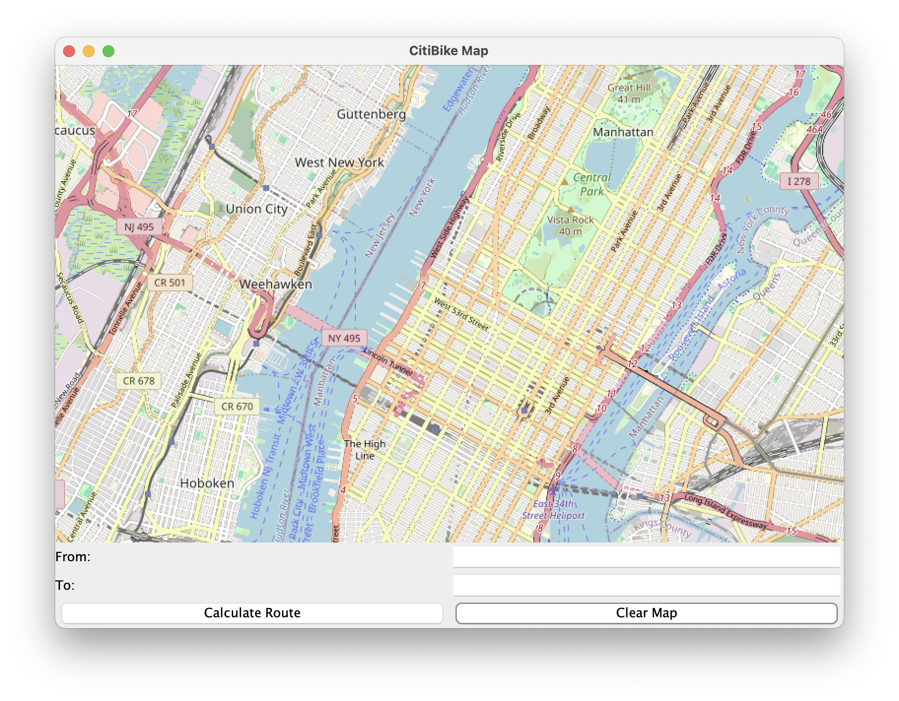
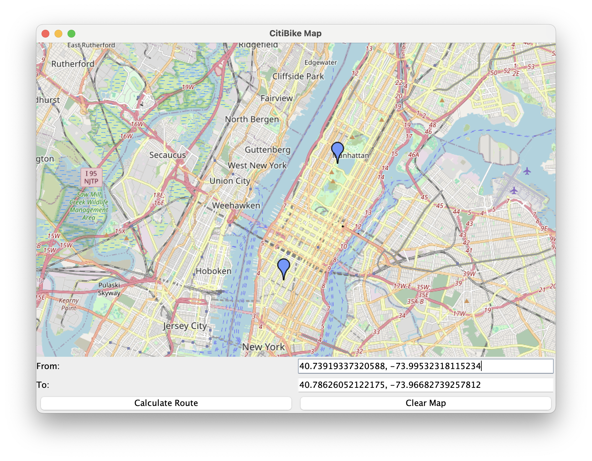
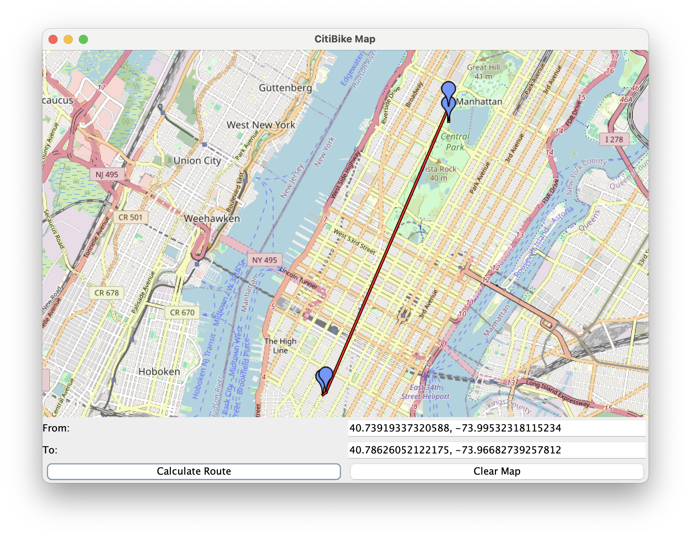

# CitiBike Route Finder

Welcome to CitiBike Route Finder! 
This project helps users find the closest CitiBike stations for renting and returning bikes based on their selected start and end locations. 
The application uses the JXMapViewer library to display an interactive map where users can click to set their locations. The application then calculates the optimal route, including the closest stations with available bikes and docks.
### What's Inside
#### Interactive Map: 
Users can click on the map to set their start and end locations.
#### Closest Station Finder: 
The application finds the closest CitiBike stations with available bikes and docks.
#### Route Calculation: 
The route includes the user's start and end locations, as well as the closest stations.
#### Zoom to Fit: 
The map automatically zooms to fit all relevant points.

### How It Works:

Set Locations: Click on the map to set the start and end locations. The coordinates will be displayed in the text fields.

Calculate Route: Click the "Calculate Route" button to find the closest stations and display the route.

Clear Map: Click the "Clear Map" button to reset the map and start over.

[Citi Bike Wikipedia](https://en.wikipedia.org/wiki/Citi_Bike)

### Technology
* [Open Street Map](https://github.com/msteiger/jxmapviewer2)
* [Json ](https://gbfs.citibikenyc.com/gbfs/en/station_information.json)
* [AWS Lambda](https://aws.amazon.com/pm/lambda/?gclid=CjwKCAiAg8S7BhATEiwAO2-R6qp5R8ZR5irjNK2ib7OE9J8FZVgsTXwYW6uhP1CbnbknVWw9dS_QDxoC59kQAvD_BwE&trk=73f686c8-9606-40ad-852f-7b2bcafa68fe&sc_channel=ps&ef_id=CjwKCAiAg8S7BhATEiwAO2-R6qp5R8ZR5irjNK2ib7OE9J8FZVgsTXwYW6uhP1CbnbknVWw9dS_QDxoC59kQAvD_BwE:G:s&s_kwcid=AL!4422!3!651212652666!e!!g!!lambda!909122559!45462427876)

### Lambda Function
* Receive Request: The Lambda function receives a request with from and to locations.
* Query CitiBike API: It queries the CitiBike API to get station information and status.
* Find Closest Stations: It finds the closest stations with available bikes and docks.
* Return Information: It returns the station information to the application.